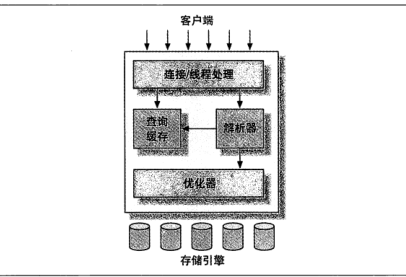
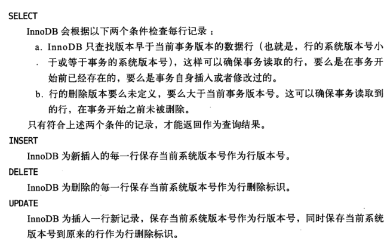

## Mysql 逻辑架构

### 1. Mysql逻辑架构图：

（1） 最上层的服务并不是Mysql所独有。大多数基于网络的客户端/服务器的工具或者服务都有类似的架构。

（2） 第二层架构是Mysql的核心部分，包括有查询解析、分析、优化、缓存以及所有的内置函数，所有跨存储引擎的功能都在这一层实现：存储过程、触发器、视图等。

（3） 第三层包含了存储引擎。存储引擎负责Mysql中数据的存储和提取。服务器通过API与存储引擎进行通信。存储引擎只是简单的响应上层服务器的请求。

 ### 2. 链接安全与管理

>   每个客户端连接都会在服务器上拥有一个线程，这个连接的查询只会在这个单独的线程中执行，该线程只能轮流在某个CPU核心或者CPU中运行。服务器会负责缓存线程，因此不需要为每一个新建的线程连接创建或者销毁线程。

>   当客户端连接到Mysql服务器时，服务器需要对其进行认证。认证基于用户名、原始主机信息和密码。
>
>   如果使用SSL(Security Socket Layer)的方式连接，还可以使用X.509证书认证。一旦客户端连接成功，服务器会继续验证该客户端是否具有执行某个特定查询语句的权限。

### 3. 优化与执行

>   Mysql会解析查询，然后对解析树进行优化。

### 4. 并发控制

1.  读写锁

    1.  读锁：共享，多个客户端可以同时读取同一个资源，互不干扰
    2.  写锁：排他，一个写锁会阻塞其他的写锁和读锁

2.  锁粒度

    1.   表锁： Mysql中最基本的锁策略，并且是开销最小的策略。
    2.   行锁：行锁可以最大程度的支持并发处理，同时也会带来最大的锁开销

    

### 5. 事务

>   事务是最小的执行单元，事务内的语句，要么全部执行成功，要么全部不执行失败。

#### 5.1 ACID原则

1.  原子性（Atomicity）

    >   事务全部执行提交成功，要么全部失败回滚。对于一个事务来说不会只执行成功一部分。

2.  一致性（consistency）

    >   数据库总是冲一个一致性的状态转变为另一个一致性的状态

3.  隔离性（isolation）

    >   通常来说，一个事务所做的修改在最终提交以前，对其他事务是不可见的。

4.  持久性（durability）

    >   一旦事务提交，其所有的修改就会永久保存到数据库中。

#### 5.2 事务日志

>   存储引擎咋修改表的数据时只需要修改其中内存拷贝，再把该修改行为记录到持久硬盘上的事务日志中，而不用每次都将修改的数据本身持久化到磁盘。事务日志采用的是追加的方式，因此写日志的操作是磁盘上一小块区域内的顺序I/O，而不像随机I/O需要在磁盘的多个地方移动磁头，所以采用事务日志的方式相对来说要快的多。事务日志被持久以后，内存中被修改的数据在后台可以慢慢的刷回磁盘，

#### 4.Mysql中的事务

Mysql中提供了两种事务的存储引擎：InnoDb和NDB Cluster。

##### 4.1 自动提交（AutoCommit）

Mysql默认采用自动提交的模式。如果不是显示的开始一个事务，则每个查询都被当作一个事务执行提交操作。

##### 4.2 在事务中混合使用存储引擎

Mysql服务器层不管理事务，事务由存储引擎实现。

如果事务中混合使用了事务型和非事务型的表（InnoDb和MyISam）,在正常提交没有问题，但是事务失败回滚时非事务型表无法撤销，这就会导致数据库处于不一致的状态。

### 6. 隔离级别

>   **Read Uncommitted（读取未提交内容）**
>
>   在该隔离级别，所有事务都可以看到其他未提交事务的执行结果。本隔离级别很少用于实际应用，因为它的性能也不比其他级别好多少。读取未提交的数据，也被称之为脏读（Dirty Read）。
>
>    
>
>   **Read Committed（读取提交内容）**
>
>   这是大多数数据库系统的默认隔离级别（但不是MySQL默认的）。它满足了隔离的简单定义：一个事务只能看见已经提交事务所做的改变。这种隔离级别 也支持所谓的不可重复读（Nonrepeatable Read），因为同一事务的其他实例在该实例处理其间可能会有新的commit，所以同一select可能返回不同结果。
>
>    
>
>   **Repeatable Read（可重读）**
>
>   这是MySQL的默认事务隔离级别，它确保同一事务的多个实例在并发读取数据时，会看到同样的数据行。不过理论上，这会导致另一个棘手的问题：幻读 （Phantom Read）。简单的说，幻读指当用户读取某一范围的数据行时，另一个事务又在该范围内插入了新行，当用户再读取该范围的数据行时，会发现有新的“幻影” 行。InnoDB和Falcon存储引擎通过多版本并发控制（MVCC，Multiversion Concurrency Control）机制解决了该问题。
>
>   
>
>   **Serializable（可串行化）**
>
>   这是最高的隔离级别，它通过强制事务排序，使之不可能相互冲突，从而解决幻读问题。简言之，它是在每个读的数据行上加上共享锁。在这个级别，可能导致大量的超时现象和锁竞争。

|     隔离级别     | 脏读可能性 | 不可重复读可能性 | 幻读可能性 | 加锁读 |
| :--------------: | :--------: | :--------------: | :--------: | :----: |
| Read UNCOMMITTED |     Y      |        Y         |     Y      |   N    |
|  Read COMMITTED  |     N      |        Y         |     Y      |   N    |
| REPEATABLE READ  |     N      |        N         |     Y      |   N    |
|   SERIALIZABLE   |     N      |        N         |     N      |   Y    |

### 7.  多版本并发控制（MVCC）

InnoDB的MVCC，是通过在每行记录后面保存两个隐藏的列来实现的。一个是保存了行的创建时间，一个保存行的过期时间（或删除时间）。当然存储的并不是真实的系统时间值，而是系统版本号，没开始一个新的事物，系统版本号就会自动递增。事务开始时刻的系统版本号会作为事务的版本号，用来和查询到的每行记录的版本号进行比较

保存这个两个额外的系统版本号，使大多数读操作都可以不用加锁。使得性能提升。不足之处是每行记录都需要额外的存储空间，需要做更多的检查工作，以及一些额外的维护工作。

MVCC只在REPERABLE READ和Read Committed两个隔离级别下工作。其他两个隔离级别都和MVCC不兼容，应为Serializable则会对所有读取数据进行加锁。